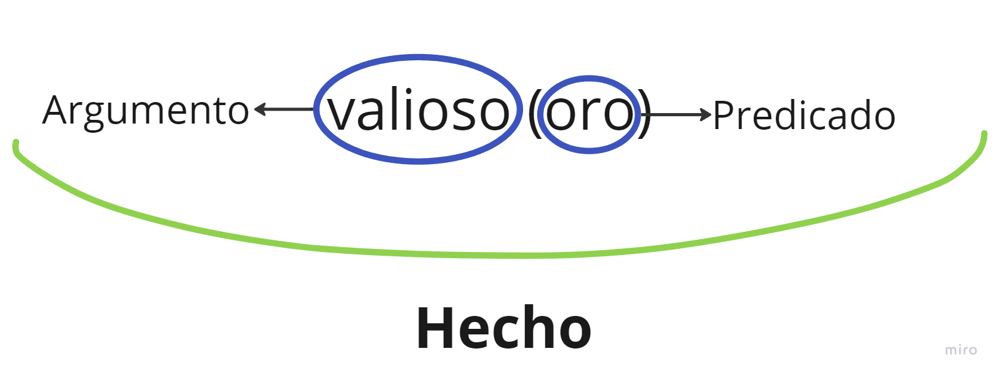

# Resumen de Prolog: Sintaxis
## Hechos
Los hechos son afirmaciones sobre el mundo. Se utilizan para representar datos y relaciones que siempre se consideran verdaderas.
Una colección de hechos se conoce como __base de hechos__

__Ejemplos de hechos:__
```prolog
hombre(carlos).
le_pertenece(maria, moneda).'
padre(homero, bart).
```
#### Hechos anidados o estructuras compuestas
```prolog
actividad(juan, deportes([futbol, skate, taekwondo])).
actividad(juan, ocupaciones([estudiante])).
```
##### Consulta
```prolog
?- actividad(leandro, X)
X = deportes([futbol, skate, taekwondo])
X = ocupaciones([estudiante])
```

## Operadores Lógicos
#### Conjunción (AND)
Representada por `,` (coma). Indica que ambas condiciones deben ser verdaderas.
```prolog
feliz(X) :- tieneTrabajo(X), buenaSalud(X).
```
`X es feliz` __si__ `X tieneTrabajo` __y__ `buenaSalud`

#### Disyunción (OR)
Representada por `;`. Se usa cuando alguna de las condiciones debe ser verdadera.
```prolog
contento(X) :- juega(X, futbol) ; juega(X, baloncesto).
```
`X está contento` __si__ `X juega al futbol` __o__ `X juega al baloncesto`

#### Negación
Representada por `+`, que significa "no es cierto que".
```prolog
no_tieneHijos(X) :- \+ padre(X, _).
```
`X no tiene hijos` __si__ `no es cierto que X es padre de alguien`

## Preguntas
#### Preguntas sin variable
Su respuesta siempre es `true/false`.
Ejemplo, consderando la siguiente base de hechos:
```prolog
le_gusta(juan, pescado).
le_gusta(juan, maria).
le_gusta(maria, libro).
le_gusta(juan, libro).
le_gusta(juan, Italia).
```
Preguntas:
```prolog
?-le_gusta(juan, dinero). Rta: false
?-le_gusta(juan, maria). Rta: true
```
#### Preguntas con variable
Su respuesta es `objeto que cumple el objetivo/false`
Preguntas:
```prolog
% ¿Qué le gusta a juan?
?-le_gusta(juan, X).
Rta: X = pescado; X = maria; X = libro; X = Italia.

% ¿A qué le gusta maria?
?-le_gusta(X, maria).
Rta: X = juan

% ¿Qué le gusta a Maria & a Juan?
?-le_gusta(maria, X), le_gusta(juan, X).
Rta: X = libro.
```


## Reglas
Las reglas definen relaciones o condiciones entre hechos. Se leen como "es verdadero si...".
En Prolog, el operador `:-` se usa para expresar "si".
```prolog
hijo(X, Y) :- padre(Y, X).
abuelo(X, Z) :- padre(X, Y), padre(Y, Z).
```
`hijo(X, Y)` es verdadero si Y es padre de X, y `abuelo(X, Z)` es verdadero si X es padre de Y y Y es padre de Z.